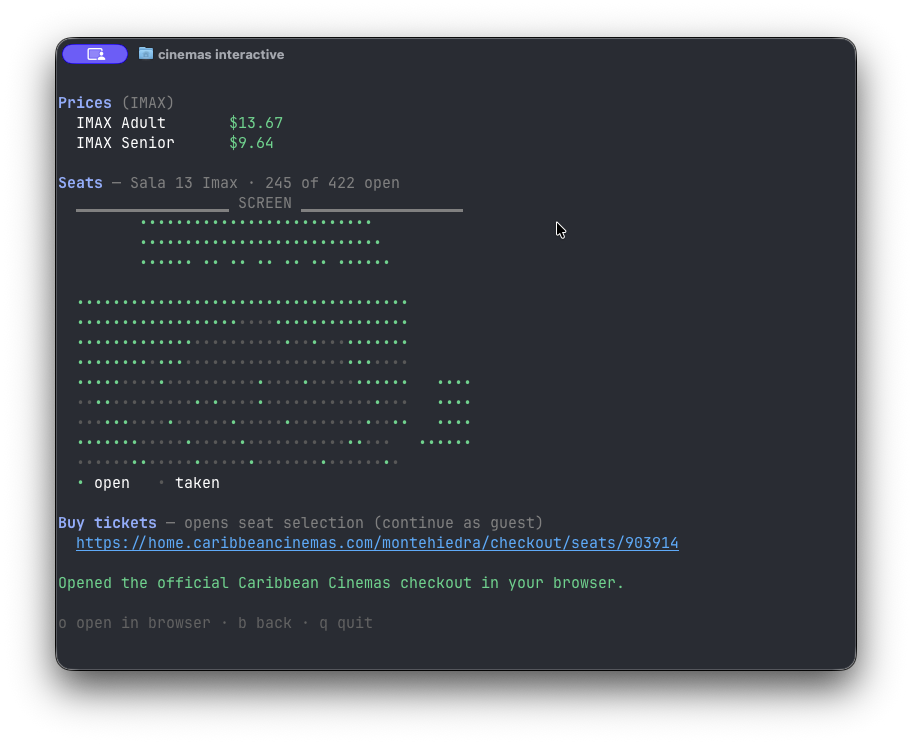

# Caribbean Cinemas CLI (Unofficial)

> [!IMPORTANT]
> This is an unofficial, community-built project. It is not affiliated with,
> maintained by, or endorsed by Caribbean Cinemas.

A read-only Go library and unofficial command-line application for browsing
[Caribbean Cinemas](https://home.caribbeancinemas.com) listings in Puerto Rico.
Search movies, theaters, showtimes, seat availability, and ticket prices from
the terminal, then continue to the official website for seat selection and
checkout.

Browsing does not require authentication. The project does not place orders,
hold seats, accept payments, or manage customer accounts. Purchase links open
the official Caribbean Cinemas website, where login and checkout take place.

## Requirements

- Go 1.26.5 or newer
- macOS, Linux, or Windows

## Install the CLI

Install the latest version with:

```sh
go install github.com/jasielrt95/caribbean-cinemas-cli/cmd/cinemas@latest
```

Go installs the executable into `GOBIN`, or into `GOPATH/bin` when `GOBIN` is
unset. If `cinemas` is not found after installation, add that directory to the
shell path. For the default Go configuration on macOS or Linux:

```sh
export PATH="$(go env GOPATH)/bin:$PATH"
```

To make the change permanent in zsh, add the same line to `~/.zshrc`, then open
a new terminal. On Windows, add `<GOPATH>\bin` to the user `Path`, replacing
`<GOPATH>` with the value printed by `go env GOPATH`.

Confirm the installation with:

```sh
cinemas --help
cinemas --version
```

### Install from a local checkout

From the repository root:

```sh
go install ./cmd/cinemas
cinemas --help
cinemas --version
```

### Use the Go library

From an existing Go module:

```sh
go get github.com/jasielrt95/caribbean-cinemas-cli@latest
```

## Library quick start

```go
client := caribbeancinemas.New()
ctx := context.Background()

// Movie IDs are specific to each theater and are used by Showtimes.
movies, _ := client.MoviesAtSite(ctx, "45")

showings, _ := client.Showtimes(ctx, movies[0].ID)
sheet, _   := client.Pricing(ctx, showings[0].ID)   // Adult $7.18, Children $4.93, ...
chart, _   := client.SeatChartForShowing(ctx, showings[0].ID)
fmt.Println(len(chart.AvailableSeats()), "seats open")

// Hand off to the official site for seat selection + checkout.
site, _ := caribbeancinemas.TheaterByID(movies[0].SiteID)
buyURL := caribbeancinemas.NewDeeplinker("").SeatSelectionURL(site.Slug, showings[0].ID)
```

The complete example is available in [`examples/basic`](examples/basic).

## CLI

Start the full-screen interactive experience with:

```sh
cinemas interactive          # movie -> theater -> showtime -> open official checkout
```



Individual commands are also available:

```sh
cinemas theaters                              # all 31 theaters
cinemas movies                                # now playing across the circuit (grouped)
cinemas movies --site 45                      # at one theater (site-specific IDs)
cinemas showtimes --title moana --site 45     # upcoming showtimes
cinemas showtimes --movie-id 485824           # or pass a site-specific movie ID
cinemas price --showing 882869                 # ticket prices
cinemas seats --showing 882869                 # ASCII seat map with availability
cinemas checkout --showing 882869              # open official seat selection
cinemas buy-link --showing 882869              # print the official URL
```

## Per-theater movie IDs

A movie does **not** have a single global ID. Each *(movie × theater)* pair is
its own record with its own ID, and a movie's showtimes are scoped to the
theater that ID belongs to.

- To list a movie across theaters, call `ListMovies` with multiple site IDs and
  group the results with `GroupByTitle`.
- To retrieve showtimes for a specific theater, pass its site-specific movie ID
  from `MoviesAtSite` or `ListMovies` to `Showtimes`.

## What it can and can't do

| Capability | Supported |
|------------|-----------|
| Browse movies (now playing, coming soon, future/events) | Yes |
| Theater directory (names, addresses, some coordinates) — embedded, no network | Yes |
| Showtimes, incl. per-showing format (dubbed/subtitled/premium) | Yes |
| Ticket prices per showing | When exposed by the public API |
| Seat map + availability (point-in-time snapshot) | Yes |
| Purchase handoff link (seat selection / checkout) | Yes |
| Buying, seat holds, live seat locking, accounts, gift cards | No (auth-gated) |

## Purchase handoff

The interactive flow stops before checkout. After a movie, theater, and
showtime are selected, `o` opens the official Caribbean Cinemas seat-selection
page in the default browser. Login, seat selection, concessions, payment, and
order management remain on the official site.

Library consumers can open
`Deeplinker.SeatSelectionURL(siteSlug, showingID)` for the same handoff. The URL
loads the seat map for the selected showtime. This project does not receive
credentials or payment data.

```go
site, _ := caribbeancinemas.TheaterByID(movie.SiteID)
url := caribbeancinemas.NewDeeplinker("").SeatSelectionURL(site.Slug, showing.ID)
// https://home.caribbeancinemas.com/plaza-americas/checkout/seats/879144
```

**Route notes.** The web app's routes are theater-slug prefixed
(`/{siteSlug}/checkout/seats/{showingId}`). The theater slug comes from
`Site.Slug` and is not derivable from the name (`The Outlet 66` → `belz`). The
unscoped `/movie/{slug}` and `/seats/{id}` routes redirect to a location picker.

## Go library

- The core client uses `net/http` and `encoding/json` from the Go standard
  library.
- Client options include `WithHTTPClient`, `WithSiteID`, and `WithUserAgent`.
- Every API method accepts a `context.Context`.
- API failures are returned as `*APIError` values with an error `Code`.
  `IsAuthRequired` identifies queries that require a customer login.
- The CLI uses Cobra, and the interactive terminal experience uses Bubble Tea.

## License

[MIT](LICENSE)
